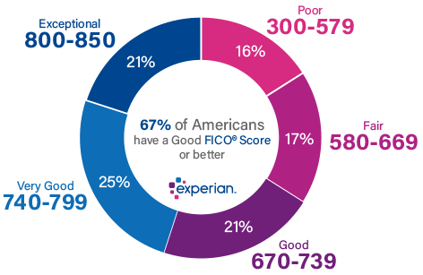
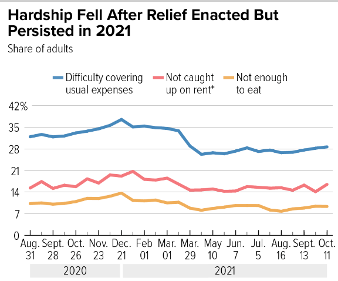

# 
 Credit Score Classification 

#### **Affiliation:** INFO-201: Technical Foundations of Informatics - The Information School - University of Washington
#### **Authors:** Lesther Dumosmog || Amy Oguejiofor || Nuria Abas Ibrahim
###  **Emails**   ldumos@uw.edu    || amyo6@uw.edu   || nuriai2@uw.edu
#### **Date:**  Autumn 2022
#### **Project:** credit_class

- - -
 

## **Abstract**

 The agenda of the project is to understand the differentiating social economic status play a role in the cultural norms in financial commitments. In order to approach this question, we will group the data by annual income showcaseing common characteristics of each catagory of salary. The importance of this data is to outline the different resources used by groups corresponding to their annual income. 

 

 

## **Keywords**
* Credit
* Intrest Rates
* Salary
* Classification
* Financial Resources

## **Introduction**
The purpose of the project is to demonstrate a professional report using software such as: Visual Studio/Atom, R, and GitHub. It focuses on communication and management with other groups within the class. The data table provided is from [kraggle](https://www.kaggle.com/datasets/clkmuhammed/creditscoreclassification?resource=download) which is on the classification of credit scores. It provides information such as annual income, age, amount of credit cards and banks, and many more columns.

## **Problem Domain**
With the appearance of Covid-19, it lead to a drastic hit in the economy as many people lack secruity in their jobs due to companies insueing layoffs. Job growth remaing slow, hours cut, instability in jobs, and overall lost in wages. The Census Bereau released data on the job market at the end of 2021, and it was noted that tens of millions of people lost their jobs ([CBPP](https://www.cbpp.org/research/poverty-and-inequality/tracking-the-covid-19-economys-effects-on-food-housing-and#:~:text=The%20COVID%2D19%20pandemic%20and,unemployment%20remained%20high%20throughout%202020.)). This had resulted in many relief programs being active. Nevertheless, 20 million households did not have enough to eat and 10 million being behing in house payments. The [U.S. Bureau of Labor Statistics](https://www.bls.gov/news.release/pdf/empsit.pdf)] recorded the changes in major worker groups in September:

 

> 1) The number of persons employed part time for economic reasons decreased by 306,000 to 3.8 million in September
> 2) The number of persons not in the labor force who currently want a job was little changed at 5.8 million in September and remains above its February 2020 level of 5.0 million
> 3) Among the unemployed, the number of permanent job losers decreased by 173,000 to 1.2 million in September
> 4) The number of discouraged workers, a subset of the marginally attached who believed that no jobs were available for them, increased by 119,000 to 485,000 in September.

The pandemic impacted everyone but was not distributed evenly to all social classes. In fact, it remained more prevalent in groups such as Blacks, Latinos, and other groups of minority. This is the result due to structual racism shifting the most economic hardships to those of color.
> Among the major worker groups, the unemployment rate for Hispanics decreased to 3.8 percent in September. The jobless rates for adult men (3.3 percent), adult women (3.1 percent), teenagers (11.4
percent), Whites (3.1 percent), Blacks (5.8 percent), and Asians (2.5 percent) showed little change over the month

## **Research Questions**

1) How has the the workforce in groups of minority been impacted?
2) What are the current trends/culture of each standing social classes?
3) How did Covid-19 affected finance in the long term?

## **The Dataset**

## **Limitations**
One thing that the data table fail to acomodate is the area of living. As some areas have low or high financial needs of living, it can have an effect on the statistics and general making desicions in
classifying the social classes. Data does lack a few information to find solutions for the problem domain. May have to find data that is more fitting.

## **Refrences**

Tracking the COVID-19 Economy’s Effects on Food, Housing, and Employment Hardships. (2022, February 10). Cbpp. https://www.cbpp.org/research/poverty-and-inequality/tracking-the-covid-19-economys-effects-on-food-housing-and#:~:text=The%20COVID%2D19%20pandemic%20and,unemployment%20remained%20high%20throughout%202020.

https://www.bls.gov/news.release/pdf/empsit.pdf

Socio-economic impact of COVID-19 | United Nations Development Programme. (n.d.). UNDP. Retrieved October 30, 2022, from https://www.undp.org/coronavirus/socio-economic-impact-covid-19?utm_source=EN
